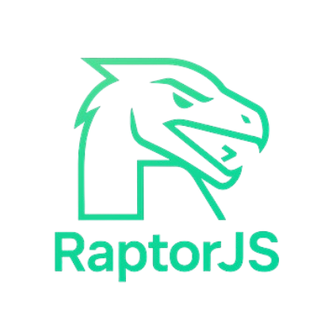

## Dependencies

[bun](https://bun.sh/)

## How to use ?

### First init the project

```npx raptorjs-discord init```

### Setup .env

Create a bot using `New Application` or select one you already have

Go to the [developers applications](https://discord.com/developers/applications)
- In **general information**: Copy your **Application ID**
- In **Bot**                : Copy your **Token**

Copy the **serverId**:
- Right click on server
- Copy Server ID

**Paste** in **.env**

```
BOT_TOKEN=your_bot_token_here
CLIENT_ID=your_client_id_here
GUILD_ID=your_guild_id_here
```

Invite the bot to your server - Don't forget to change the CLIENT_ID

```https://discord.com/api/oauth2/authorize?client_id=<CLIENT_ID>&permissions=0&scope=bot%20applications.commands```

### You're ready to go!

to start the bot *bun run bot*

*All framework commands start with `bun x raptorjs`*

```
Available commands:
  help            - Display this help message.
  init            - Initialize the project structure.
  addCommand      - Add Command
  rmCommand       - Remove command
  addOpt          - Add Option to one command
  rmOpt           - Remove Option to one command
  addModel        - Add a new model. Usage: addModel <name>
  migrate         - Run database migrations.
  renameModel     - Rename a model and its DB table. Usage: renameModel <oldName> <newName>
  deleteModel     - Delete a model and its DB table. Usage: deleteModel <name>
  rollback        - Rollbacks
```

(ps :merci le bro ayoub)
